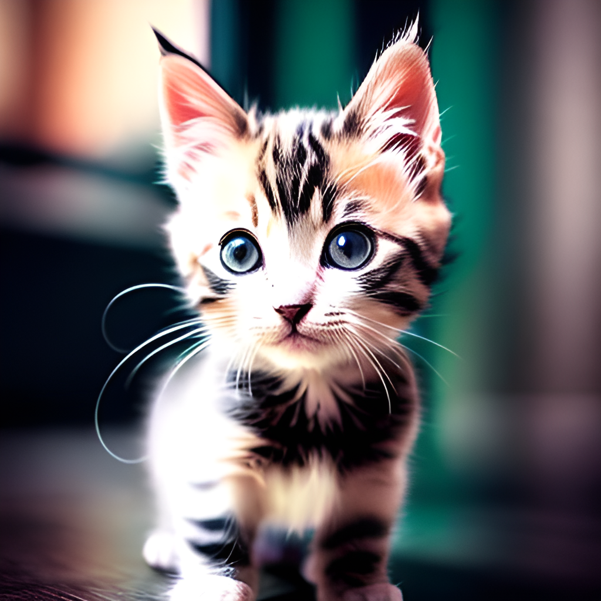
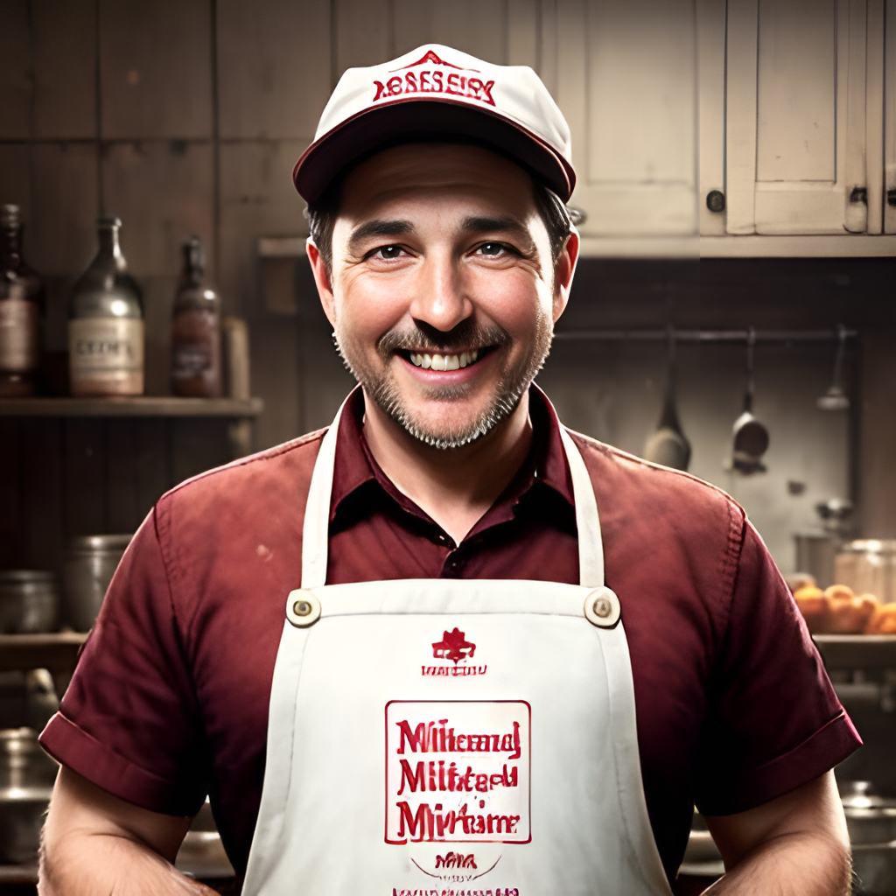
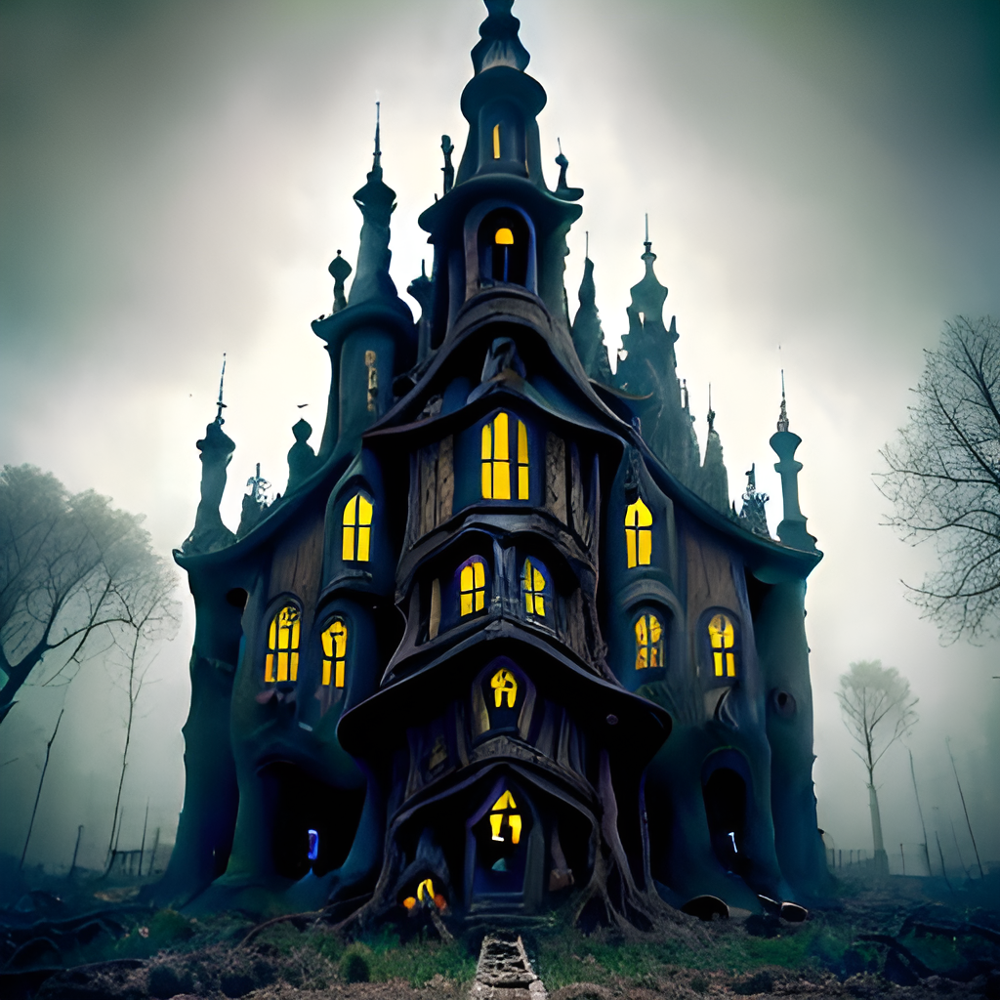
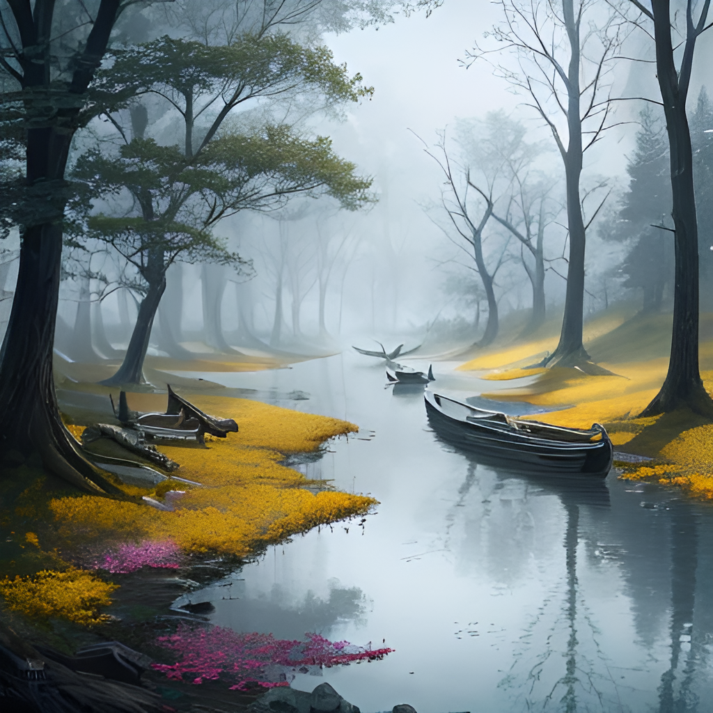
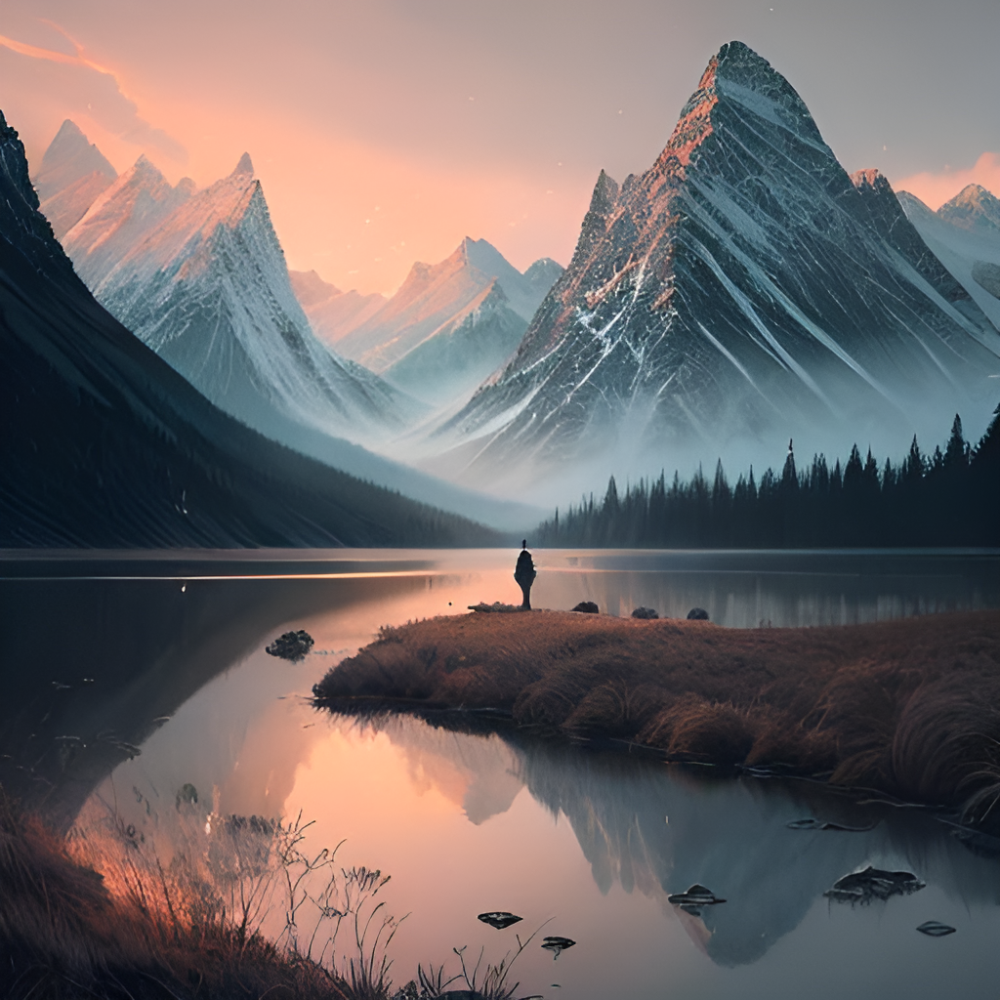

# Overview

This repository contains several notebooks that implement various diffusion models for generating images. Each notebook generates different type of images, so you can choose the notebook that corresponds to the type of image you want to generate.

## Notebooks

1. ```deliberate_allInOne.ipynb``` - This model has the ability to create anything you want. You just need to put your thoughts about the image you want to generate into words and pass a detailed prompt to the model. You'll still get a decent result with a good prompt so, improvise on the prompt to make it better. Some sample images from the model:

<figure>
<p align="center">
    
    
    
</p>
<figcaption align = "center"><b>Deliberate-v2 model sample images.</b></figcaption>
</figure>

2. ```dreamshaper_realisticPaintings.ipynb``` This is a model to make good portraits that do not look like cg or photos with heavy filters, but more like actual paintings. Can do great backgrounds and anime style characters. With right prompts, this model is like a miracle. Some interesting results from the model:
<figure>
<p align="center">
    
    
    
</p>
<figcaption align = "center"><b>Dreambake model sample images.</b></figcaption>
</figure>
