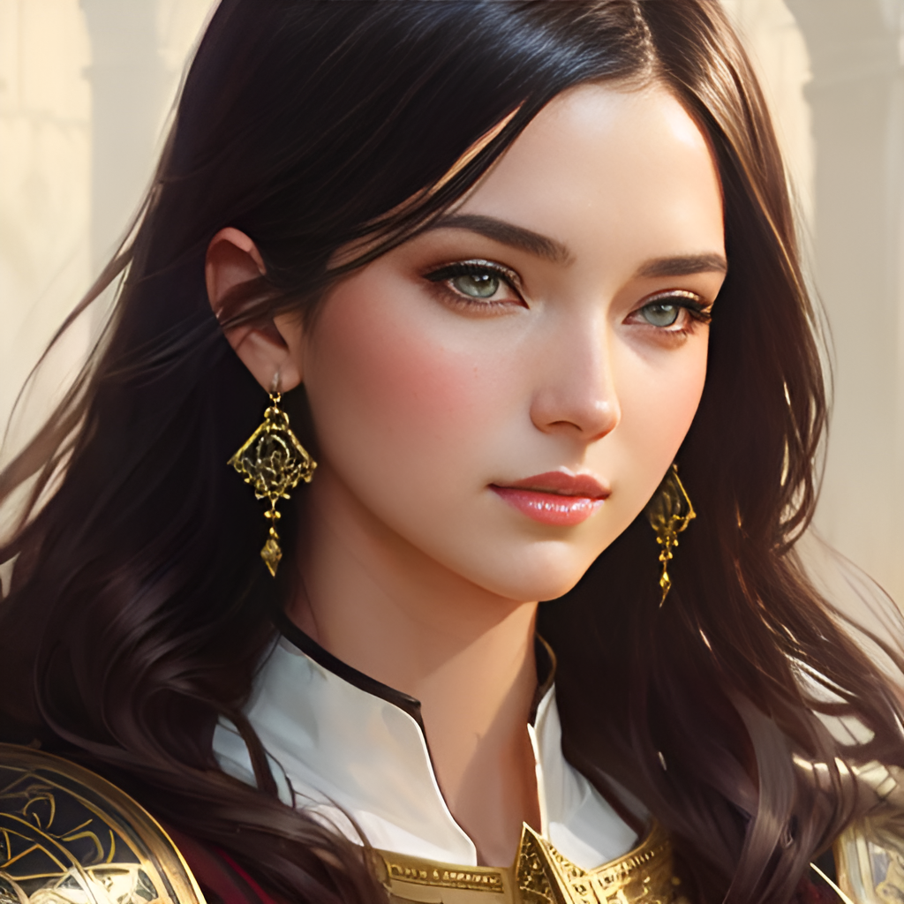
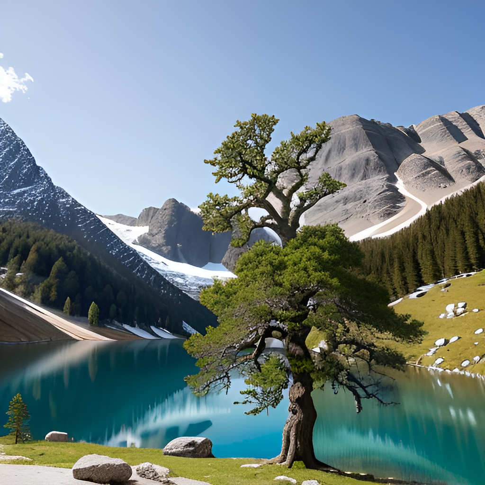
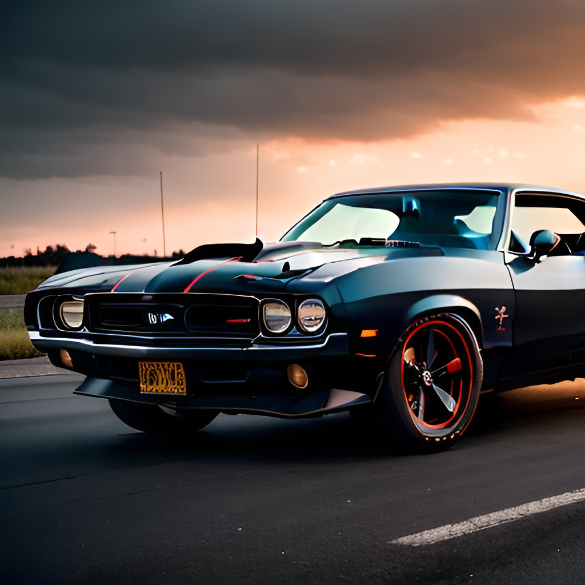
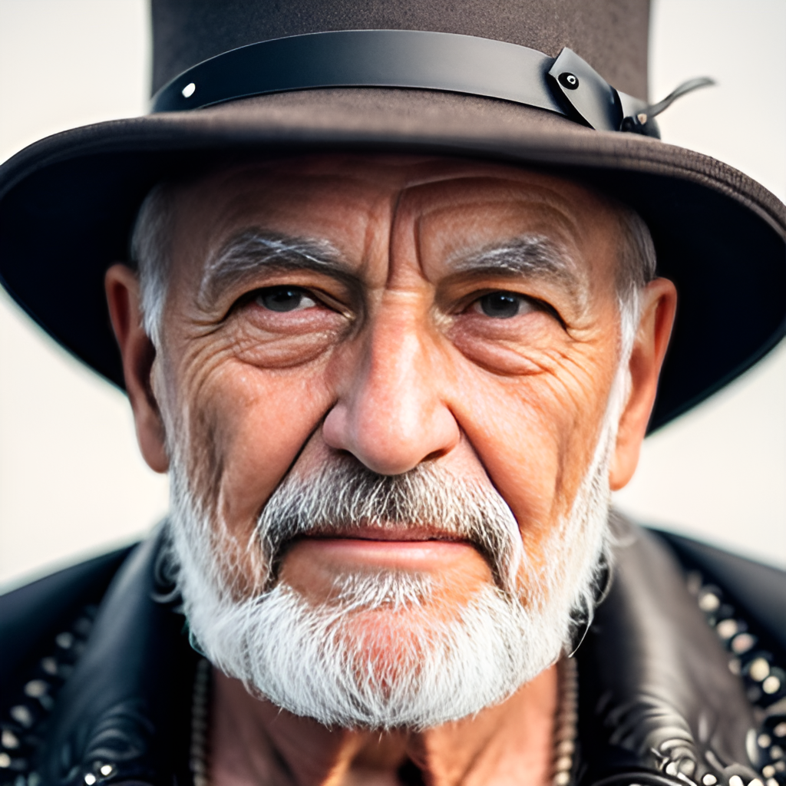
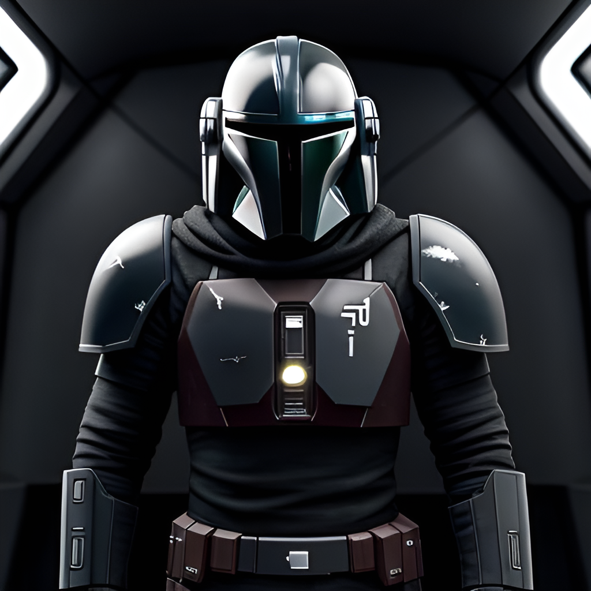
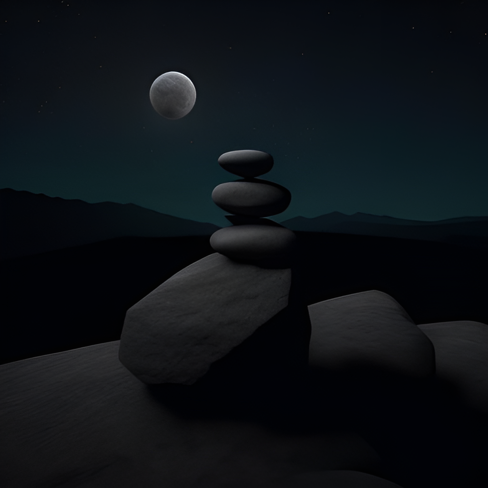
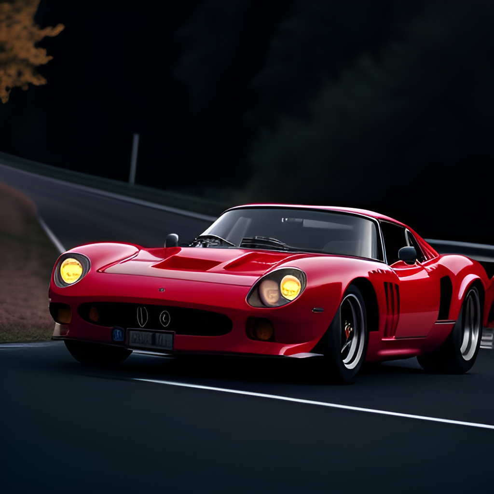
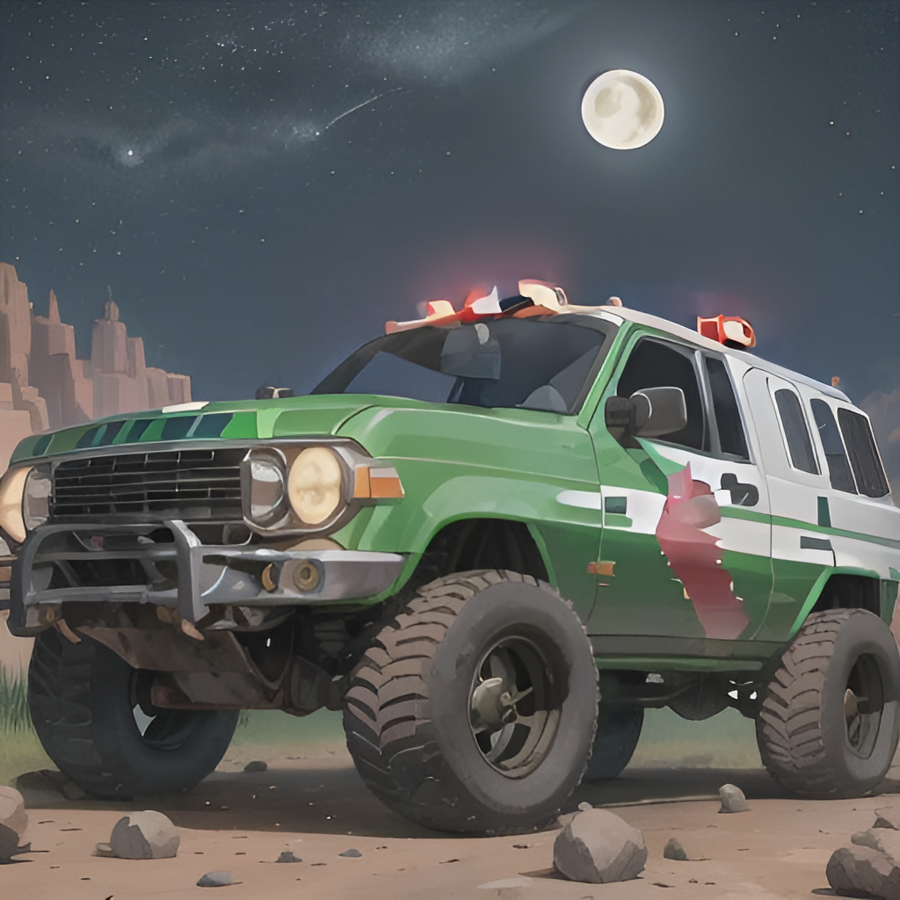
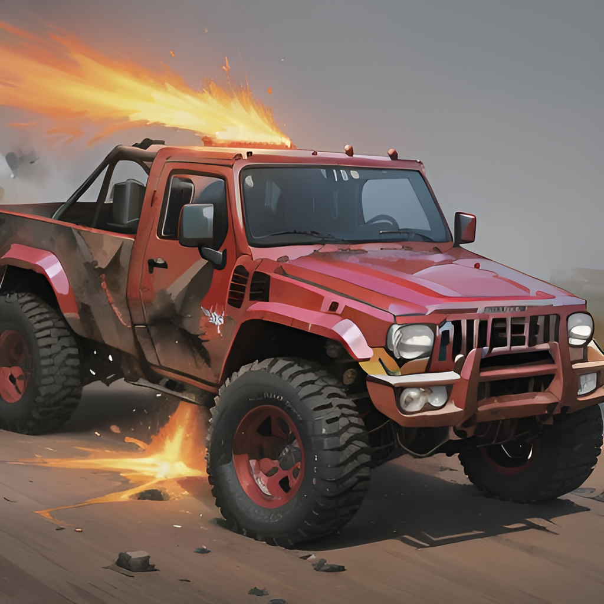
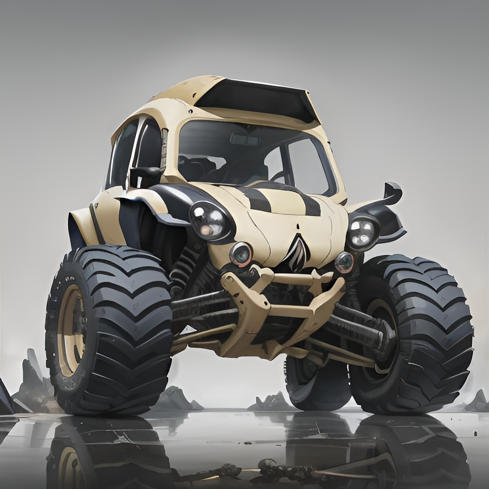

# Overview

This repository contains several notebooks that implement various diffusion models for generating images. Each notebook generates different type of images, so you can choose the notebook that corresponds to the type of image you want to generate.

## Notebooks

1. [deliberate_allInOne.ipynb](https://github.com/makaveli10/diffusion/blob/main/deliberate_allInOne.ipynb) - This model has the ability to create anything you want. You just need to put your thoughts about the image you want to generate into words and pass a detailed prompt to the model. You'll still get a decent result with a good prompt so, improvise on the prompt to make it better. Some sample images from the model:

<figure>
<p align="center">
    
    
    
</p>
</figure>

2. [dreamshaper_realisticPaintings.ipynb](https://github.com/makaveli10/diffusion/blob/main/dreamshaper_realisticPaintings.ipynb) This is a model to make good portraits that do not look like cg or photos with heavy filters, but more like actual paintings. Can do great backgrounds and anime style characters. With right prompts, this model is like a miracle. Some interesting results from the model:
<figure>
<p align="center">
    
    
    
</p>
</figure>

3. [photorealistic.ipynb](https://github.com/makaveli10/diffusion/blob/main/photorealistic.ipynb) - This model generates photorealistic images. Even with a very simple prompt it can generate realistic images and with a detailed prompt it is even better. Some results from the model:
<figure>
<p align="center">
    
    
    
</p>
</figure>

4. [lowra_lowKey.ipynb](https://github.com/makaveli10/diffusion/blob/main/lowra_lowKey.ipynb) - This model generates ```low key``` images. Generates character where they have their own style in terms of lighting and overall atmosphere. It is an amazing model to generate low light images. A few interesting samples from the model:
<figure>
<p align="center">
    
    
    
</p>
</figure>

5. [battleCars.ipynb](https://github.com/makaveli10/diffusion/blob/main/battleCars.ipynb) - This model can turn any vehicle into a battle car. Its a lot fun to actually play with it. It creates the battle vehicles with abstract environment. Some battle cars generated by the model:
<figure>
<p align="center">
    
    
    
</p>
</figure>

## Want to generate something different?
With the notebooks in this repository and the provided Docker container, you can easily generate a wide range of images using various diffusion models. Simply choose the notebook that corresponds to the type of image you want to generate, and follow the instructions to start generating images!
Further, if you want to checkout other models?:
- Go to [civit-ai](https://civitai.com/). 
- Choose a model of your choice and copy the link to the finetuned model checkpoint
- And load it with our API. Checkout the examples in the notebooks to get detailed information.
