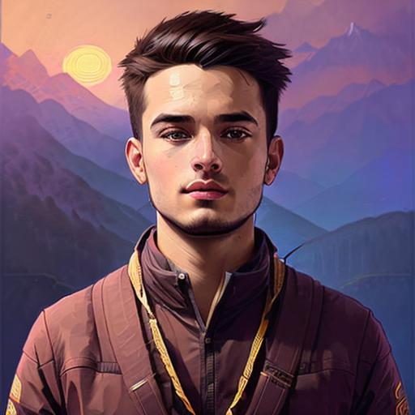
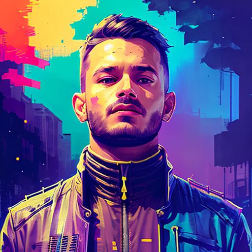
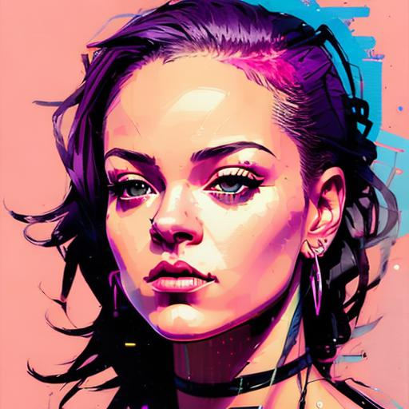

# Train a diffusion model on your own Images

## Overview
- Create a folder ```train_imgs``` and upload 5-10 images of you; could be close-up portraits, selfies or full body pictures. Dont have any pictures of you? Click a few right now. 
- And that is pretty much it for the initial setup.
- Start the [stable_diffusion_training.ipynb](https://github.com/makaveli10/diffusion/blob/main/stable_diffusion_training.ipynb) notebook, and train your own diffusion model.
- Takes around 10-15 minutes to train depending on the number of images.

## Results
- Some results after fine-tuning the model on my own images:
<figure>
<p align="center">
    
    
    
</p>
</figure>
<figure>
<p align="center">
    
    
    
</p>
</figure>

- A few images after fine-tuning on Rihanna's images:
<figure>
<p align="center">
    
    
    
</p>
</figure>
<figure>
<p align="center">
    
    
    
</p>
</figure>